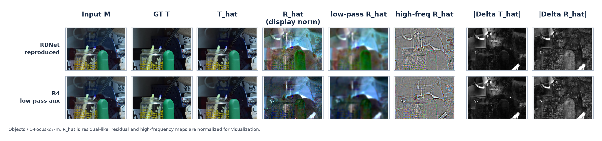

# Low-Pass Auxiliary Supervision for RDNet
**The whole experiments of ERRNet**
https://github.com/flyingc2004/ERRNet

Course-project repository for single-image reflection removal. This repository
combines the course ERRNet baseline, the XReflection/RDNet codebase, the final
R5 training pipeline, and a unified public benchmark.

The project follows the method path used in the accompanying report:

```text
ERRNet baseline
  -> RDNet explicit residual branch
  -> LowAux reflection-residual supervision
  -> scene-balanced RRW real pairs
  -> unified public benchmark
```

The final R5 method keeps the RDNet inference architecture unchanged and trains
the explicit residual branch with:

- the original raw reflection-residual supervision;
- a Gaussian low-pass reflection-residual auxiliary loss with weight `0.2`;
- scene-balanced paired frames from RRW.

Model weights, datasets, experiment logs, benchmark outputs, and third-party
model repositories are intentionally excluded from Git.

## Repository Layout

```text
ERRNet/                 ERRNet baseline and E5b model/training source
XReflection/            XReflection package containing RDNet and LowAux changes
scripts/train/          Training and environment preparation entrypoints
scripts/data/           RRW scene-manifest preparation
scripts/benchmark/      Unified public benchmark and model adapters
scripts/verify/         LowAux and R5 data-pipeline verification
configs/benchmark/      Fixed course-local-five benchmark configuration
manifests/              Small filename lists safe to track in Git
external/               Local-only weights, datasets, and third-party repos
```

## Method Summary

The course baseline is ERRNet. Its internal improvement path tests enhanced
synthetic data, real unaligned pairs, and a lightweight E5b refinement branch.
These changes improve the baseline, but ERRNet remains a single-output
transmission-regression model and does not expose the removed reflection
component as a trainable branch.

R5 therefore uses RDNet as an explicit decomposition backbone. For each output
scale, RDNet predicts transmission and residual-branch outputs. The training
target for the residual branch is the residual pseudo-label `R_res = M - T`,
not a physically exact reflection layer. LowAux keeps this raw residual target
as the main supervision and adds a symmetric low-pass auxiliary term:

```text
L_low^R = MSE(G_sigma(R_hat), G_sigma(R_res))
```


where `G_sigma` is a normalized depth-wise Gaussian blur with kernel `31` and
sigma `5.0`. The auxiliary term is used only during training and does not add
inference parameters or computation.

## External Resources

Place local-only resources under `external/` or override paths in the scripts
and benchmark config.

```text
external/
  weights/
    errnet_e0.pt
    errnet_e5b_stage2.pt
    rdnet-26.4849.ckpt
    rdnet_r4_epoch1.ckpt
    rdnet_r5_final.ckpt
    cls_model.pth
    focal.pth
    final_net_G_T.pth
    final_net_G_R.pth
    dsrnet_l_4000_epoch33.pt
    dist-large-setting2-epoch66.pth
    swin_large_o365_finetune.pth
  datasets/
    course_local5/
      testdata_CEILNET_table2/
      real20/
      postcard/
      objects/
      wild/
  models/
    IBCLN/
    DSRNet/
    DSIT/
RRW/                    optional local RRW root, or set RRW_ROOT=/path/to/RRW
```

The RDNet training config also needs the original SIRR training data:

```text
XReflection/data/sirs/
  train/real/
  train/nature/
  train/VOCdevkit/VOC2012/PNGImages/
  train/VOC2012_224_train_png.txt
```

All of these paths are ignored by Git.

## Environment

Create the ERRNet and XReflection environments according to their original
requirements. The RDNet preparation helper can install the XReflection package
and download official RDNet dependencies:

```bash
bash scripts/train/prepare_rdnet.sh
```

Verification commands that import RDNet, PyTorch, or public-model adapters
should be run in the `xreflection` environment. A plain system `python` may not
have `torch` or the model dependencies installed.

## ERRNet Baseline and E5b

Run the original ERRNet baseline training from `ERRNet/`:

```bash
cd ERRNet
python train_errnet.py --name errnet --hyper
```

Run the final E5b two-stage refinement pipeline from the repository root:

```bash
bash scripts/train/train_errnet_e5b.sh
```

E5b freezes the ERRNet backbone and trains a dilated refiner, then unfreezes
the complete model for joint fine-tuning. Set `STAGE1_INIT_CKPT` if the E3
initialization checkpoint is stored elsewhere.

## Final RDNet R5 Training

R5 uses the fixed mixture:

```text
Real89 15% | Nature200 15% | VOC synthetic 55% | scene-balanced RRW 15%
```

RRW is split by scene with seed `20260611` into 147 training, 15 validation,
and 5 holdout scenes. Eight frames are sampled from each training scene per
epoch. The helper below prepares the manifests automatically before training.

```bash
RRW_ROOT=/path/to/RRW \
PRETRAIN_NETWORK_G=external/weights/rdnet_r4_epoch1.ckpt \
GPU_IDS=0,1,2,3 \
bash scripts/train/train_rdnet_r5.sh
```

The script fixes R5 to `residual_lowpass_aux`, Gaussian kernel `31`, sigma
`5.0`, auxiliary weight `0.2`, BF16 mixed precision, and `SAVE_TOP_K=3` by
default.

For a configuration dry-run:

```bash
DRY_RUN=1 \
RRW_ROOT=/path/to/RRW \
PRETRAIN_NETWORK_G=/tmp/missing.ckpt \
bash scripts/train/train_rdnet_r5.sh
```

`DRY_RUN=1` still prepares the RRW manifests and writes generated configs under
Git-ignored `results/`.

## Unified Public Benchmark

The benchmark evaluates ERRNet E0, ERRNet E5b, IBCLN, DSRNet, DSIT, RDNet
official, and R5 through model-specific adapters and one shared evaluator. It
computes float-domain PSNR, SSIM, NCC, and LMSE on CEILNet Table2, Real20,
Postcard, Objects, and Wild, then reports an equal-weight five-dataset macro
average.

Place external resources according to
`configs/benchmark/course_local5_open_models.yml`, then run:

```bash
PYTHONPATH="$PWD/ERRNet:$PWD/scripts/benchmark" \
conda run --no-capture-output -n xreflection \
python scripts/benchmark/run_public_benchmark.py \
  --config configs/benchmark/course_local5_open_models.yml \
  --gpu-ids 0,1,2,3 \
  --output-dir results/public_benchmark/course_local5
```

Resume an interrupted benchmark by adding `--resume`.

If `external/datasets/course_local5` or required weights are missing, benchmark
dry-runs or smoke tests are expected to fail with missing-path errors. That is a
setup problem, not a benchmark-code failure.

## Reported R5 Result

Under the unified public benchmark used in the report, final R5 obtains:

| Method | PSNR | SSIM | NCC | LMSE |
| --- | ---: | ---: | ---: | ---: |
| R5 macro average | 27.546 | 0.9220 | 0.9751 | 0.004760 |

These numbers are reported for the fixed five-dataset macro average and should
not be mixed with model-specific official benchmark implementations.

## Verification

Static shell and Python checks:

```bash
bash -n scripts/train/*.sh

PYTHONPYCACHEPREFIX=/tmp/lowaux-pycache python -m py_compile \
  scripts/data/prepare_rrw_r5_manifests.py \
  scripts/verify/verify_rdnet_lowpass.py \
  scripts/verify/verify_rdnet_r5_data.py \
  scripts/benchmark/run_public_benchmark.py \
  scripts/benchmark/public_benchmark/adapters.py \
  scripts/benchmark/verify_public_open_models.py
```

LowAux helper check:

```bash
conda run --no-capture-output -n xreflection \
python scripts/verify/verify_rdnet_lowpass.py --xreflection-root XReflection
```

R5 data-pipeline check:

```bash
DRY_RUN=1 RRW_ROOT=/path/to/RRW \
PRETRAIN_NETWORK_G=/tmp/missing.ckpt \
bash scripts/train/train_rdnet_r5.sh

conda run --no-capture-output -n xreflection \
python scripts/verify/verify_rdnet_r5_data.py \
  --xreflection-root XReflection \
  --rrw-root /path/to/RRW \
  --manifest-dir results/rdnet_data/r5_rrw \
  --config results/rdnet_configs/rdnet_r5_rrw_only_from_r4_e1.yml
```

Open-model adapter smoke tests require the corresponding external repositories
and weights:

```bash
conda run --no-capture-output -n xreflection \
python scripts/benchmark/verify_public_open_models.py \
  --config configs/benchmark/course_local5_open_models.yml \
  --worker-model dsrnet_official
```

## Reproducibility Checklist

1. Prepare the ERRNet and XReflection Python environments.
2. Place external weights, open-model repositories, and course-local-five data
   under `external/`.
3. Prepare `XReflection/data/sirs/` training data and the VOC filename list.
4. Set `RRW_ROOT` or place RRW at `RRW/`.
5. Run the R5 dry-run to generate RRW manifests and a training config.
6. Run R5 training with `scripts/train/train_rdnet_r5.sh`.
7. Run the unified public benchmark with the fixed config.
8. Compare macro metrics against the report table.

## Source Attribution

See [THIRD_PARTY_NOTICES.md](THIRD_PARTY_NOTICES.md) for upstream sources and
license/terms notes.

- ERRNet: *Single Image Reflection Removal Exploiting Misaligned Training Data
  and Network Enhancements*, CVPR 2019.
- RDNet: *Reversible Decoupling Network for Single Image Reflection Removal*,
  CVPR 2025.
- RRW: *Revisiting Single Image Reflection Removal in the Wild*, CVPR 2024.

Third-party model repositories, pretrained weights, and datasets remain
external and are not redistributed through this Git repository.
